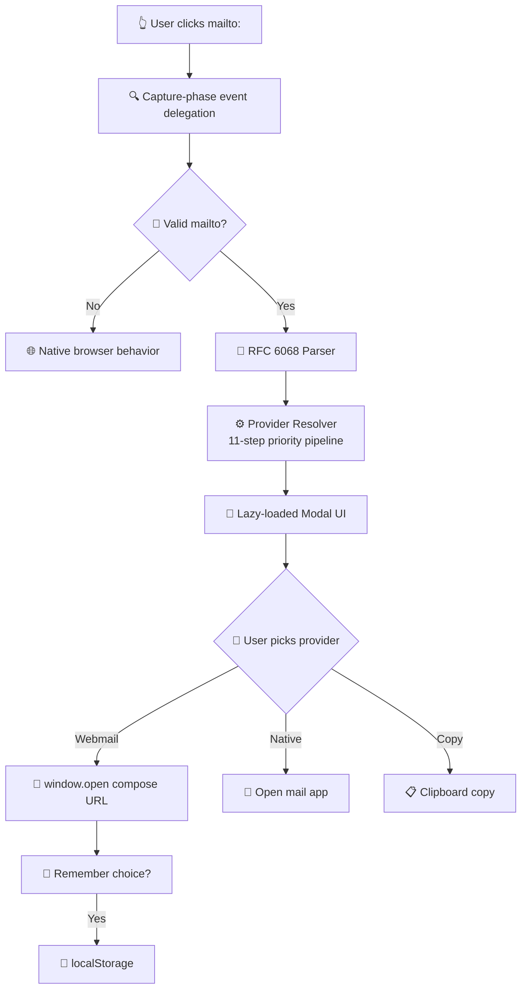

<!-- STYLISH README FOR GITHUB - OPTIMIZED FOR RENDERING -->

<div align="center">

<!-- CUSTOM BADGES ROW -->
<p>
  
  
  
  
  
</p>

<p>
  <a href="https://www.npmjs.com/package/@smart-mailto/core">
    
  </a>
  <a href="https://github.com/namandhakad712/smart-mailto/actions/workflows/ci.yml">
    
  </a>
  <a href="https://bundlephobia.com/package/@smart-mailto/core">
    
  </a>
  <a href="https://github.com/namandhakad712/smart-mailto/blob/main/LICENSE">
    
  </a>
  <a href="https://smart-mailto.vercel.app">
    
  </a>
</p>

<!-- 3D ICON PLACEHOLDER - EMOJI BASED FOR GITHUB RENDERING -->
<h1>
  
  <span style="font-family: 'SF Pro Display', -apple-system, BlinkMacSystemFont, 'Segoe UI', sans-serif; font-weight: 700; background: linear-gradient(135deg, #2DD4BF 0%, #14B8A6 100%); -webkit-background-clip: text; -webkit-text-fill-color: transparent; font-size: 3.2em;">smart-mailto</span>
</h1>

<p style="font-size: 1.35em; color: #0D9488; font-weight: 500; margin-top: -10px;">
  ✉️ Replace broken <code style="background: #f0fdfa; color: #0D9488; padding: 2px 8px; border-radius: 4px; font-size: 0.85em;">mailto:</code> links with a geo-aware webmail picker
</p>

<p>
  <a href="https://smart-mailto.vercel.app"><strong>📖 Documentation</strong></a> ·
  <a href="https://smart-mailto.vercel.app/docs/browser-support"><strong>🌐 Compatibility</strong></a> ·
  <a href="https://smart-mailto.vercel.app/examples"><strong>💡 Examples</strong></a> ·
  <a href="https://www.npmjs.com/package/@smart-mailto/core"><strong>📦 npm</strong></a> ·
  <a href="https://github.com/namandhakad712/smart-mailto"><strong>⭐ GitHub</strong></a>
</p>

</div>

---

## 🎯 The Problem

The `mailto:` protocol was designed in 1997 for a world where every computer had a configured desktop email client. **That world no longer exists.**

| Pain Point               | Impact                                       |
| ------------------------ | -------------------------------------------- |
| 🖥️ **Desktop users**     | ~40% have no configured mail client          |
| 🍎 **macOS users**       | Unwanted desktop app invocations             |
| 🐧 **Linux / Corporate** | No handler or locked-down default client     |
| 📱 **Mobile users**      | Blank screens or forced into unwanted apps   |
| 🌍 **International**     | Default client doesn't match user preference |

**Result:** Lost contacts. Lost leads. Lost revenue.

---

## ✨ The Solution

**smart-mailto** intercepts every `mailto:` link on your page and shows a beautiful, geo-aware provider picker modal. Zero configuration required — it just works.

```html
<!-- Before — broken for ~40% of the internet -->
<a href="mailto:hello@company.com">Contact Us</a>

<!-- After — one line of JavaScript -->
<script type="module">
  import { initSmartMailto } from 'https://cdn.jsdelivr.net/npm/@smart-mailto/core';
  initSmartMailto({ theme: 'auto', autoDetectGeo: true });
</script>
```

<div align="center">

```text
┌─────────────────────────────────────────────────┐
│  ✉  Open Email With                             │
│      hello@company.com  ·  Hello World          │
│                                                 │
│  [ 🟦 Gmail ]  [ 🟦 Outlook ]  [ 🟦 Yahoo ]     │
│  [ 🟪 Proton ]  [ 🟦 iCloud ]  [ 📋 Copy ]     │
└─────────────────────────────────────────────────┘
```

</div>

---

## 📊 Performance Metrics

| Metric                      | Value               | Status                                          |
| --------------------------- | ------------------- | ----------------------------------------------- |
| 📦 **Gzipped bundle**       | **< 8 KB**          | ✅ 7.4 KB                                       |
| 🔌 **Runtime dependencies** | **0**               | ✅ Zero                                         |
| 🌐 **Webmail registry**     | **51** entries      | ✅ **31** compose links + **20** fallback pages |
| ⚡ **Geo detection**        | **< 1 ms** (~0.4ms) | ✅                                              |
| 🚀 **Link-to-modal**        | **< 20 ms**         | ✅                                              |
| 🧪 **Test coverage**        | **90%+**            | ✅ Enforced in CI                               |
| 🔒 **Network requests**     | **0**               | ✅ Privacy-safe                                 |
| 🌍 **Regions supported**    | **30+**             | ✅                                              |

> 💡 **CI rejects any build where gzipped `dist/index.js` exceeds 8,192 bytes.**

---

## 🚀 Quick Start

### Installation

```bash
npm install @smart-mailto/core
# or
pnpm add @smart-mailto/core
# or
yarn add @smart-mailto/core
```

### CDN (no bundler required)

```html
<script type="module">
  import { initSmartMailto } from 'https://cdn.jsdelivr.net/npm/@smart-mailto/core/dist/index.js';
  initSmartMailto({ theme: 'auto', autoDetectGeo: true });
</script>
```

---

## 🔧 Framework Integration

<details>
<summary><strong>⚛️ React (17+) — Click to expand</strong></summary>

```tsx
import { SmartMailtoProvider, SmartMailto } from '@smart-mailto/react';

export default function App() {
  return (
    <SmartMailtoProvider theme="auto" autoDetectGeo>
      <SmartMailto href="mailto:hello@example.com">Contact Us</SmartMailto>
    </SmartMailtoProvider>
  );
}
```

**Features:**

- `<SmartMailtoProvider>` — global interceptor, initializes once
- `<SmartMailto>` — component wrapper, self-contained
- `useSmartMailto()` — programmatic hook

</details>

<details>
<summary><strong>💚 Vue 3 — Click to expand</strong></summary>

```ts
import { createApp } from 'vue';
import { SmartMailtoPlugin } from '@smart-mailto/vue';

createApp(App).use(SmartMailtoPlugin, { theme: 'auto', autoDetectGeo: true }).mount('#app');
```

</details>

<details>
<summary><strong>🔶 Svelte — Click to expand</strong></summary>

```svelte
<script>
  import { smartMailto } from '@smart-mailto/svelte';
</script>

<a href="mailto:hello@example.com" use:smartMailto={{ theme: 'dark' }}>
  Contact Us
</a>
```

</details>

---

## 🌍 Geo Detection — How It Works

smart-mailto uses **only browser-exposed signals** — no IP geolocation, no cookies, no external requests.

```ts
// Signals collected in < 1ms
const timeZone = Intl.DateTimeFormat().resolvedOptions().timeZone; // Europe/Moscow
const locale = navigator.language; // ru-RU
const isMobile = /iPhone|iPad|iPod|Android/i.test(navigator.userAgent);
```

### Regional Provider Priority

| 🌏 Region             | 📍 Timezone        | 🏆 Top Providers                          |
| --------------------- | ------------------ | ----------------------------------------- |
| 🇷🇺 **Russia / CIS**   | `Europe/Moscow`    | Yandex, Mail.ru, Gmail                    |
| 🇨🇳 **China**          | `Asia/Shanghai`    | QQ Mail, 163 Mail, Gmail                  |
| 🇯🇵 **Japan**          | `Asia/Tokyo`       | Yahoo! Japan, Gmail, iCloud               |
| 🇰🇷 **South Korea**    | `Asia/Seoul`       | Naver, Daum/Kakao, Gmail                  |
| 🇩🇪 **Germany / DACH** | `Europe/Berlin`    | GMX, WEB.DE, T-Online, Posteo             |
| 🇫🇷 **France**         | `Europe/Paris`     | Laposte, Gmail, Outlook, ProtonMail       |
| 🇮🇳 **India**          | `Asia/Kolkata`     | Gmail, Yahoo, Zoho, Rediff                |
| 🇺🇸 **USA**            | `America/New_York` | Gmail, Outlook, Yahoo, iCloud             |
| 🇬🇧 **UK**             | `Europe/London`    | Gmail, Outlook, Yahoo, iCloud             |
| 🌍 **Global Default** | —                  | Gmail, Outlook, Yahoo, ProtonMail, iCloud |

- **150+ IANA timezones** mapped to provider priority lists
- **30+ locale patterns** override timezone when confidence is higher
- Works in **< 1ms** with **zero network requests**

---

## 🏗️ How It Works



**Resolver Pipeline (11 steps):**

1. **Custom providers** — prepended to list
2. **Email domain detection** — `@gmail.com` → Gmail first
3. **config.preferredProvider** — developer override
4. **Saved preference** — returning users
5. **Auto-detected geo list** — timezone/locale heuristics
6. **Mobile override** — native app to top on phones
7. **excludeProviders** — filtered out
8. **includeNative** — toggle native option
9. **IDs → Provider objects** — skip unknown IDs
10. **maxProviders slice** — cap visible buttons
11. **Copy button appended** — always last

---

## 🎨 Modal Features

<div align="center">

| Feature                | Description                                           |
| ---------------------- | ----------------------------------------------------- |
| 🎭 **Shadow DOM**      | Complete CSS isolation — no host page leakage         |
| 🔒 **Safari-safe**     | `window.open()` called synchronously in click handler |
| ♿ **Accessible**      | Focus trap, ESC close, ARIA attributes, WCAG 2.1 AA   |
| 🌓 **Themes**          | Dark / Light / Auto (prefers-color-scheme)            |
| 📱 **Responsive**      | Mobile-first grid layout                              |
| 🌍 **Region badge**    | Shows detected region (e.g. "📍 Germany")             |
| 🔖 **Preferred badge** | Highlights email-domain-matched provider              |
| 📏 **Compact**         | `max(680px, 90dvh)` height, scrollable content        |

</div>

---

## 🔌 Full Configuration

```ts
interface SmartMailtoConfig {
  theme?: 'dark' | 'light' | 'auto';
  autoDetectGeo?: boolean;
  preferredProvider?: string; // Force specific provider
  maxProviders?: number; // Cap visible providers (default: 6)
  includeNative?: boolean; // "Open in Mail App" button
  includeCopy?: boolean; // Copy-to-clipboard fallback
  excludeProviders?: string[]; // Blacklist provider IDs
  customProviders?: Provider[]; // Enterprise/whitelabel providers
  rememberChoice?: boolean; // Persist to localStorage
  storageKey?: string; // Custom localStorage key
  classNames?: {
    // Headless mode — own CSS
    overlay?: string;
    modal?: string;
    providerButton?: string;
    copyButton?: string;
  };
  i18n?: Partial<{
    title: string;
    copy: string;
    copied: string;
    native: string;
    close: string;
  }>;
  onOpen?: (provider: Provider, params: MailtoParams) => void;
  onCopy?: (email: string) => void;
  onClose?: () => void;
  onShow?: (params: MailtoParams, providers: Provider[]) => void;
}
```

---

## 📬 Provider Ecosystem

<div align="center">

### 🌍 Global

Gmail · Outlook · Yahoo Mail · Proton Mail · iCloud · Fastmail · Zoho · Tutanota

### 🌏 Regional

Yandex · Mail.ru · QQ Mail · 163 Mail · Yahoo! Japan · Naver · Daum/Kakao · GMX · WEB.DE · T-Online · Posteo · mailbox.org · La Poste · Libero Mail · Onet · WP Poczta · Seznam · UKR.NET · Rediffmail · Mailfence · Runbox · Disroot · Riseup · Rambler · Alibaba Mail · O2 · Interia

### 🛡️ Privacy-Focused

Proton Mail · Tutanota · Posteo · mailbox.org · Disroot · Riseup · Runbox · Mailfence

### 🔧 Actions

🖥️ **Native Mail App** — opens default client<br>
📋 **Copy Address** — clipboard fallback

</div>

---

## 🔒 Privacy — Zero Compromise

| Signal             | smart-mailto                    | Competitors   |
| ------------------ | ------------------------------- | ------------- |
| External API calls | **0**                           | Often 1+      |
| Cookies            | **None**                        | Sometimes     |
| IP Geolocation     | **None**                        | Common        |
| localStorage       | **1 string** (provider id only) | Varies        |
| Network requests   | **0 at runtime**                | Often present |

smart-mailto reads only:

- `Intl.DateTimeFormat().resolvedOptions().timeZone`
- `navigator.language` / `navigator.languages`
- `navigator.userAgent` (mobile detection only)

---

## 🧪 Mailto Parser (RFC 6068)

```ts
// Multi-recipient, URL-decoded, round-trip safe
parseMailto('mailto:hello@site.com?cc=boss@site.com&subject=Hello%20World&body=Hi%20there');
// → { to: ['hello@site.com'], cc: ['boss@site.com'], subject: 'Hello World', body: 'Hi there' }

// Round-trip reconstruction
buildMailtoHref({ to: ['a@x.com', 'b@x.com'], subject: 'Hi', body: 'Hello' });
// → 'mailto:a@x.com,b@x.com?subject=Hi&body=Hello'
```

**Supported fields:**

- `to`, `cc`, `bcc` — multi-recipient, comma-separated, Unicode, plus-addressing
- `subject`, `body` — URL-decoded/re-encoded per provider
- `%2C` encoded commas — correctly handled

> ⚠️ **Note:** ProtonMail and Tuta Mail are E2EE and block body pre-fill. The modal surfaces a "Message pre-filled" note for these providers.

---

## 📦 Packages

| Package                                                                      | Description                        | Peer Dependencies |
| ---------------------------------------------------------------------------- | ---------------------------------- | ----------------- |
| [`@smart-mailto/core`](https://www.npmjs.com/package/@smart-mailto/core)     | Zero-dep framework-agnostic engine | None              |
| [`@smart-mailto/react`](https://www.npmjs.com/package/@smart-mailto/react)   | React 17+ wrapper                  | `react >= 17`     |
| [`@smart-mailto/vue`](https://www.npmjs.com/package/@smart-mailto/vue)       | Vue 3 wrapper                      | `vue >= 3`        |
| [`@smart-mailto/svelte`](https://www.npmjs.com/package/@smart-mailto/svelte) | Svelte 4+ wrapper                  | `svelte >= 4`     |

---

## 🛠️ Development

```bash
git clone https://github.com/namandhakad712/smart-mailto.git
cd smart-mailto
pnpm install

pnpm test                # Vitest + jsdom, 90%+ coverage
pnpm typecheck           # TypeScript strict across workspace
pnpm build               # Turbo-driven build
pnpm dev                 # Run all packages in watch mode
pnpm validate:providers  # Live-check all provider compose URLs
```

### Test Structure

```
packages/core/__tests__/
├── parser.test.ts      RFC 6068 · encoding · multi-recipients · round-trip
├── provider.test.ts    URL builders · encoding · registry
├── detector.test.ts    domain → provider · enterprise heuristics
├── geo.test.ts         timezone/locale ordering · no-duplicates invariant
├── resolver.test.ts    11-step priority pipeline
├── init.test.ts        capture-phase delegation · event handling
├── icons.test.ts       ICONS record snapshot
└── storage.test.ts     localStorage wrappers
```

### Adding a Provider

```bash
# 1. Add entry to tools/provider-generator/data/providers.json
# 2. Regenerate TypeScript
pnpm generate:providers

# 3. Validate compose URL
pnpm validate:providers

# 4. Update geo.ts if regional
# 5. Add tests in packages/core/__tests__/providers.test.ts
```

---

## 🤝 Contributing

Contributions welcome! Check out our [contributing guidelines](https://github.com/namandhakad712/smart-mailto/blob/main/CONTRIBUTING.md).

- 🐛 **Bug reports** — open an issue with a minimal reproduction
- ✨ **New providers** — see `CONTRIBUTING.md` + `provider-generator`
- 🌍 **Geo mappings** — extend `TIMEZONE_PROVIDERS` / `LOCALE_PROVIDERS` in `geo.ts`
- 📝 **Docs / translations** — always appreciated
- 🧪 **Tests** — improve coverage

---

## 📄 License

MIT © smart-mailto contributors

---

<div align="center">

**Built with 💎 for the open web**

⭐ [Star on GitHub](https://github.com/namandhakad712/smart-mailto) · 📖 [Read the Docs](https://smart-mailto.vercel.app) · 📦 [npm Package](https://www.npmjs.com/package/@smart-mailto/core) · 🚀 [Try Live Demo](https://smart-mailto.vercel.app)

<br/><br/>

<a href="https://github.com/namandhakad712/smart-mailto">
  
</a>

</div>
